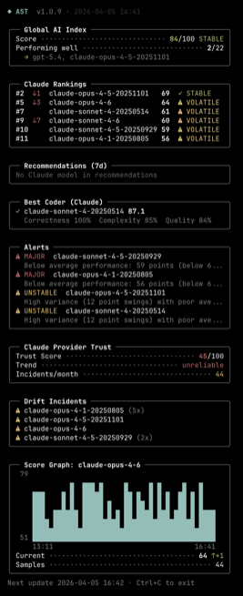

# AST - AI Stupidity Tracker

[](https://github.com/erdembircan/ai-stupidity-tracker/actions/workflows/ci.yml)

A CLI tool that tracks AI model performance on [aistupidlevel.info](https://aistupidlevel.info/) — supports Claude/Anthropic and OpenAI, right from your terminal.



## What it shows

- **Global Index** — overall AI health score and trend
- **Model Rankings** — where all tracked models rank on the leaderboard
- **Recommendations (7d)** — 7-day rolling picks: best for code, most reliable, fastest, best value
- **Best Coder** — provider's top model for coding, calculated from 9-axis benchmark data
- **Alerts** — active degradations, instability warnings, and models to avoid
- **Provider Trust** — trust score, trend, and incident count
- **Drift Incidents** — detected performance drift for tracked models

## Requirements

- **macOS** (Sequoia 15+ ships with both dependencies)
- `curl` — built-in
- `jq` — built-in on macOS Sequoia+, otherwise `brew install jq`

## Installation

### Homebrew

```bash
brew install erdembircan/tap/ast
```

### Manual

```bash
git clone git@github.com:erdembircan/ai-stupidity-tracker.git
cd ai-stupidity-tracker
chmod +x ast
ln -s "$(pwd)/ast" /usr/local/bin/ast
```

## Usage

```bash
ast                              # Claude status report (default)
ast --openai                     # OpenAI status report
ast --claude                     # Claude status report (explicit)
ast --watch                      # Live dashboard, refreshes every 60s
ast --watch 300                  # Live dashboard, custom interval (300s)
ast --graph=claude-opus-4-6      # Live score graph for a model (implies --watch)
ast --track=claude-opus-4-6      # Highlight a model name in the output
ast --json                       # Machine-readable JSON output
ast --section=coder              # Show only Best Coder section
ast --section=rankings,alerts    # Show specific sections in order
ast --version                    # Show version number
ast --help                       # Show usage info
NO_COLOR=1 ast                   # Disable colors
```

Valid sections: `global`, `rankings`, `recommendations`, `coder`, `alerts`, `trust`, `drift`, `graph`

Provider and section flags can be combined with any other option:

```bash
ast --openai --json            # OpenAI data as JSON
ast --openai --watch           # Live OpenAI dashboard
ast --openai --section=coder   # OpenAI best coder only
```

## Development

```bash
make check      # Run lint + format check + tests
make test       # Run tests offline (mock API fixtures)
make test-live  # Run tests against the live API
make lint       # ShellCheck
make fmt        # shfmt format check
```

## Data source

All data is fetched from the [aistupidlevel.info](https://aistupidlevel.info/) REST API. No scraping, no headless browser — just clean JSON endpoints.

## License

[Apache-2.0](LICENSE)
