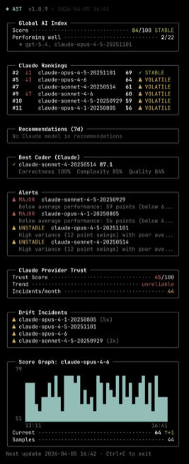

# AST - AI Stupidity Tracker

[](https://github.com/erdembircan/ai-stupidity-tracker/actions/workflows/ci.yml)

A CLI tool that tracks AI model performance on [aistupidlevel.info](https://aistupidlevel.info/) — supports Claude/Anthropic and OpenAI, right from your terminal.



## What it shows

- **Global Index** — overall AI health score and trend
- **Model Rankings** — where all tracked models rank on the leaderboard
- **Recommendations (7d)** — 7-day rolling picks: best for code, most reliable, fastest, best value
- **Best Coder** — provider's top model for coding, scored from its latest real 9-axis code-benchmark run using the site's published axis weights
- **Alerts** — active degradations, instability warnings, and models to avoid
- **Provider Trust** — trust score, trend, and incident count
- **Drift Incidents** — detected performance drift for tracked models
- **Switch Suggestion** — keep-or-switch verdict for the model you track, measured against the provider's top model over the last 24h of real runs (`--track`)
- **Score Graph** — live sparkline of one model's score over time (`--graph`)

## Requirements

- **macOS** (Sequoia 15+ ships with both dependencies)
- `curl` — built-in
- `jq` — built-in on macOS Sequoia+, otherwise `brew install jq`

## Installation

### Homebrew

```bash
brew install erdembircan/tap/ast
```

### Manual

```bash
git clone git@github.com:erdembircan/ai-stupidity-tracker.git
cd ai-stupidity-tracker
chmod +x ast
ln -s "$(pwd)/ast" /usr/local/bin/ast
```

## Usage

```bash
ast                              # Claude status report (default)
ast --openai                     # OpenAI status report
ast --claude                     # Claude status report (explicit)
ast --watch                      # Live dashboard, refreshes every 1800s (30 min)
ast --watch 300                  # Live dashboard, custom interval (300s)
ast --graph=claude-opus-4-6      # Live score graph for a model (implies --watch)
ast --track=claude-opus-4-6      # Highlight a model and show the switch suggestion
ast --json                       # Machine-readable JSON output
ast --section=coder              # Show only Best Coder section
ast --section=rankings,alerts    # Show specific sections in order
ast --version                    # Show version number
ast --help                       # Show usage info
NO_COLOR=1 ast                   # Disable colors
```

Valid sections: `global`, `rankings`, `recommendations`, `coder`, `alerts`, `trust`, `drift`, `graph`

Provider and section flags can be combined with any other option:

```bash
ast --openai --json            # OpenAI data as JSON
ast --openai --watch           # Live OpenAI dashboard
ast --openai --section=coder   # OpenAI best coder only
```

## Switching models live

When you run watch mode with `--track` or `--graph`, press `m` to open the model picker: use the arrow keys to move through the current provider's models — each shown with its score and status — and press `Enter` to switch. `Esc` cancels. The dashboard footer shows an `m switch model` hint whenever the picker is available.

The newly selected model becomes the tracked and graphed target immediately, no restart required. Switching resets the score graph so it starts collecting fresh history for the new model.

```bash
ast --graph=claude-opus-4-6      # start graphing one model...
                                 # ...then press m to switch to another
```

## Switch suggestion

`--track` also turns on a **Switch Suggestion** box at the top of the report. It answers one question: should you keep using the model you track, or move to the provider's current top model?

The verdict is measured, not guessed. For every model of the selected provider, `ast` pulls the real code-benchmark runs of the last 24 hours (`/api/models/<id>/history?period=24h`, hourly suite only, synthetic placeholder rows excluded) and takes their average as the model's *level*. The top model is the one with the highest level. The gap between your model's level and the top level is then compared with the *noise band* — how much scores normally jump from one run to the next, computed from those same runs across all models. Gap inside the band means the two models are not distinguishable on today's data: `KEEP`. Gap beyond the band: `SWITCH`, and the box names the top model.

The rule uses whatever runs exist. With one run per model it compares those single runs; as runs accumulate, the levels and the band become sharper on their own. The box always shows the run counts it worked from.

```
  ╭── Switch Suggestion ────────────────────────────────╮
  │ ⚠ SWITCH  claude-sonnet-4-6                         │
  │   → claude-opus-5 82.0 (3 runs)                     │
  │   Tracked 71.0 (2 runs) · gap 11.0                  │
  │   Noise band ±2.8                                   │
  ╰─────────────────────────────────────────────────────╯
```

Other outcomes: `NO DATA` when the tracked model has no real run in the last 24 hours, `NOT FOUND` when no model of the selected provider matches the tracked name, and `UNAVAILABLE` when the runs could not be fetched.

`--track` takes the exact model name as it appears in the rankings — matching is not fuzzy, and a prefix such as `claude-opus` is not enough. The name is checked against the live model list on startup: when it matches no model of the selected provider, `ast` exits with an error listing the available models, the same way `--graph` does.

The box is tied to `--track` only. `--graph` does not show it, and `--section` neither adds nor removes it. In watch mode it is re-evaluated on every refresh, and when you switch the tracked model with `m` it follows the new selection.

```bash
ast --track=claude-opus-4-8          # one-shot report with the suggestion box
ast --watch --track=claude-opus-4-8  # live; press m to track another model
```

## Development

```bash
make check      # Run lint + format check + tests
make test       # Run tests offline (mock API fixtures)
make test-live  # Run tests against the live API
make lint       # ShellCheck
make fmt        # shfmt format check
```

## Data source

All data is fetched from the [aistupidlevel.info](https://aistupidlevel.info/) REST API. No scraping, no headless browser — just clean JSON endpoints.

## License

[Apache-2.0](LICENSE)
